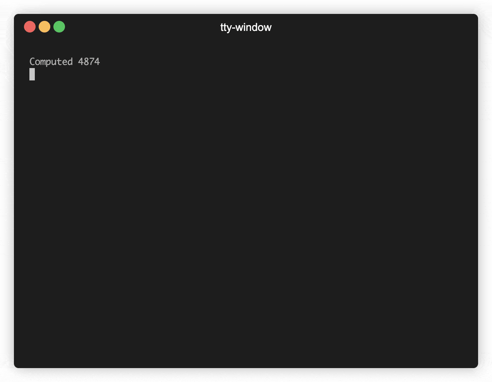

# tty-window

This package allows you to create a fixed "render window" in a TTY, to show status and progress info alongside spooling logs.

The contents of the render window will only be visible if the output is a TTY.



## Example

```ts
const window = new TtyRenderWindow({
  // defaults:
  disableWordWrap = true, // emits VT-100 codes to prevent long lines wrapping
  fps = 15, // frames per second throttling for the render function
  stream = process.stdout,
});

const row1 = new TextRow("row 1");
const row2 = new TextRow("row 2");

// add the rows to the window – this will schedule a render
window.add(row1);
window.add(row2);

// log a message to the console as normal. This will be logged even if the
// output is not a TTY. A render will be scheduled to output the render window
// at the end of the new output
window.interrupt("log message");

// change the text of row1. A render will be scheduled automatically.
row1.text = "hello world";

// output a log and remove the row (the log will be output even in non-TTY)
row1.ended = "Done!";

// just remove the row without outputting anything. This will result in an empty
// line at the end of the output until something else is written
row2.ended = true;

// ALTERNATIVELY:
window.remove(row1, "Done!");
window.remove(row2);
```
